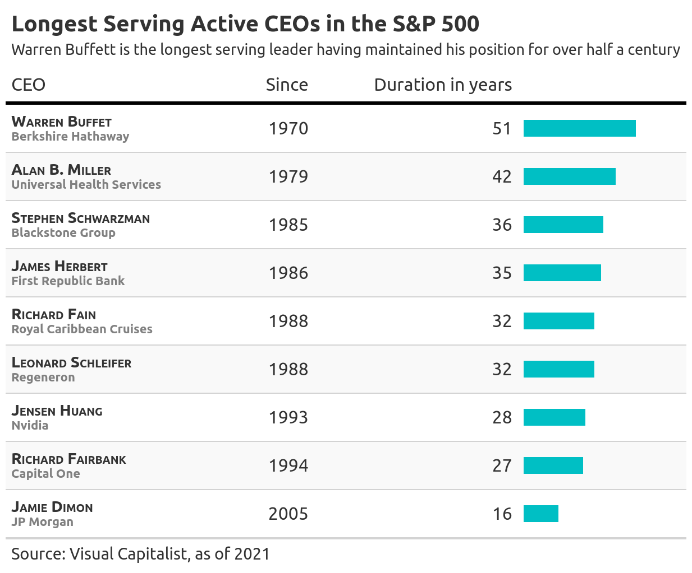
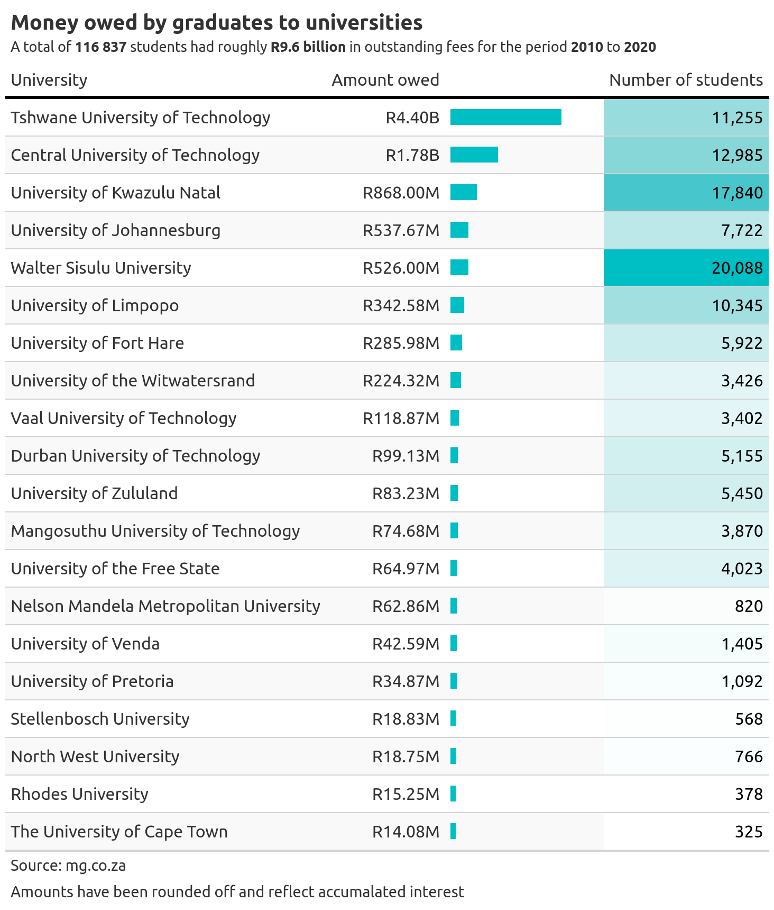

## Awesome graphics with code

## 10. The longest reigning chess champion

## 9. Largest African Banks by Assets

## 8. Annual consumer price inflation (South Africa)

## 7. The cost of winning the Premier League

## 6. Premier League Top Scorers (2021-2022)

## 5. Longest Serving Active CEOs in the S&P 500

## 4. South Africa’s unemployment rate hits new record of 34.9%

## 3. Debt drives students to despair

## 2. Most regular-season games by a player with 9 or more 3 pointers made

## 1. Where NBA teams stand on in-arena attendance

