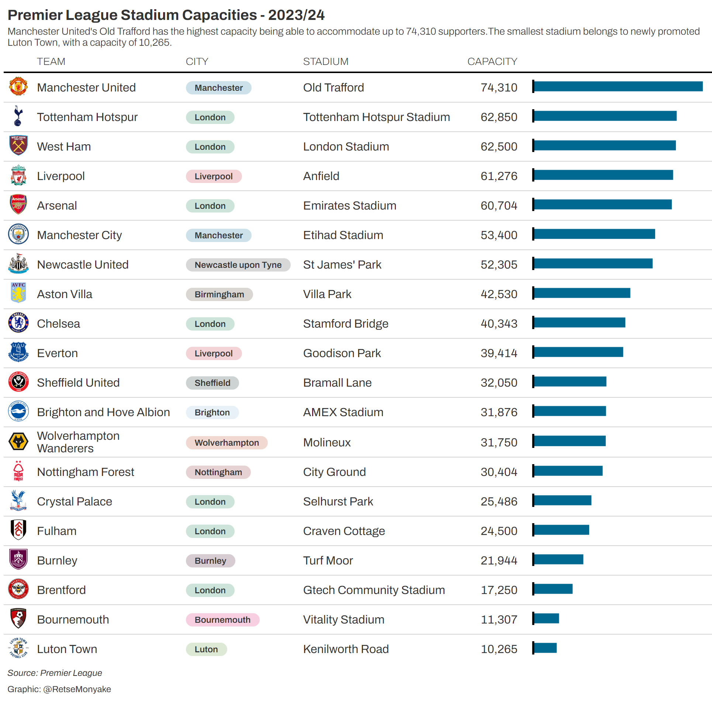
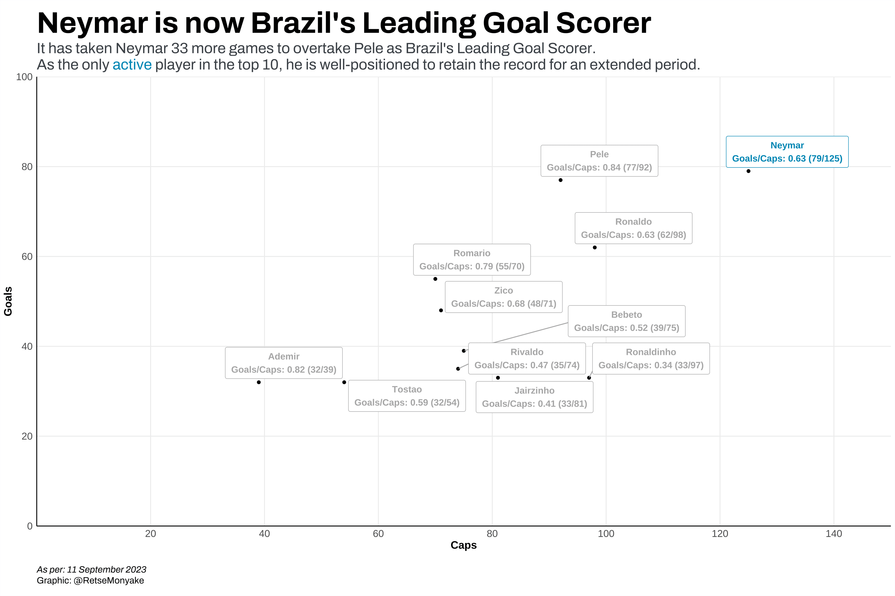

# Awesome graphics with code

# 15 Deloitte Football Money League 2024

# 14 Premier League Stadium Capacities - 2023/24

# 13. Brazil top scorers of all time

# 12. Recreation: Goldman Sachs Loses Top M&A Ranking

[Original graphic can be found in this bloomberg article](https://www.bloomberg.com/news/articles/2023-06-29/goldman-sachs-loses-top-m-a-ranking-for-first-time-in-five-years)

## 11. Contribution of top goal scorers in the premier league (2022/23)

## 10. The longest reigning chess champion

## 9. Largest African Banks by Assets

## 8. Annual consumer price inflation (South Africa)

 

## 7. The cost of winning the Premier League

## 6. Premier League Top Scorers (2021-2022)

## 5. Longest Serving Active CEOs in the S&P 500

## 4. South Africa's unemployment rate hits new record of 34.9%

## 3. Debt drives students to despair

 

## 2. Most regular-season games by a player with 9 or more 3 pointers made

## 1. Where NBA teams stand on in-arena attendance

